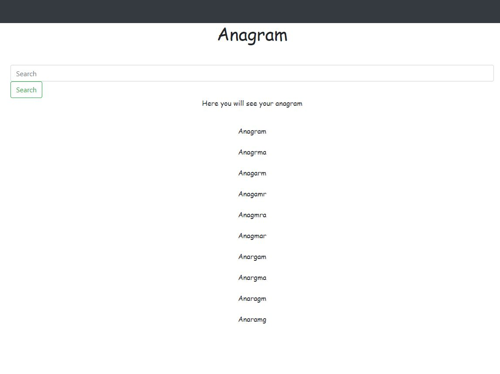

# Python_Django_Anagram

I created the anagram generator that takes

as an input a word and produce list of possible anagrams 

## First of all, we need to install dependencies
>  pip3 install -r requirements.txt 

## Secondly, we need to start by running server

> python manage.py runserver

